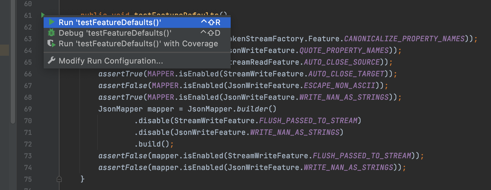

# SWE 261P Project Report

## Part 1 Introduction, Set Up, Functional Testing and Partitioning.

### 1.1 General information

* The tool we are testing.

We are testing a tool called [`jackson`](https://github.com/FasterXML/jackson).

* The purpose of this tool.

It is a JAVA library to work with JSON data format. According to it's github
page, Jackson has been known as "the Java JSON library" or "the best JSON parser
for Java". Or simply as "JSON for Java".

* Other relevant information.

The tool is written in JAVA.

The LOC is about 111K.

This tool has 3 components:

* [`jackson-core`](https://github.com/FasterXML/jackson-core):
  this component contains core low-level incremental ("streaming") parser and generator abstractions used by Jackson Data
  Processor.
* [`jackson-annotations`](https://github.com/FasterXML/jackson-annotations):
  this component contains general purpose annotations for Jackson Data Processor, used on value and handler types.
* [`jackson-databind`](https://github.com/FasterXML/jackson-databind):
  this component contains the general-purpose data-binding functionality and tree-model for
  Jackson Data Processor.
    * A lot of tutorials can be found in this
      [documentation](https://github.com/FasterXML/jackson-docs) page.
    * Javadocs can be find in this
      [wiki](https://github.com/FasterXML/jackson-databind/wiki) page.

We will be focusing on the high-level `jackson-databind` in this project.

### 1.2 Build and Running

* First, fork this project from
  [jackson-databind](https://github.com/FasterXML/jackson-databind) github page.
* Clone this project with `Github Desktop` or `Sourcetree`.

#### 1.2.1 Building with IntelliJ

* Open this project from local disk.
* Since it's a `Maven` project, follow
  [link](https://www.jetbrains.com/help/idea/delegate-build-and-run-actions-to-maven.html#delegate_to_maven)
  here to delegate build and run actions to Maven, basically it's

```
IntelliJ IDEA -> Preferences -> Build, Execution, Deployment
-> Build Tools -> Maven -> Runnder
-> select Delegate IDE build/run actions to maven.
```

* The second step is to comment out line 232-382 in `pom.xml`, otherwise
  the building process would fail.
* To build the project, press `Cmd+F9`
* After build succeeds, a jar file called `jackson-databind-3.0.0-SNAPSHOT.jar`
  will be generated under `./target` directory.

#### 1.2.2 Use `jackson-databind`

* Create a maven project and add the following dependencies in `pom.xml`.

```xml
<dependencies>
    <!-- Builds on core streaming API; also needs core annotations -->
    <dependency>
        <groupId>com.fasterxml.jackson.core</groupId>
        <artifactId>jackson-annotations</artifactId>
        <version>3.0-SNAPSHOT</version>
    </dependency>
    <dependency>
        <groupId>com.fasterxml.jackson.core</groupId>
        <artifactId>jackson-core</artifactId>
        <version>3.0.0-SNAPSHOT</version>
    </dependency>
</dependencies>
```

* Add the compiled `jackson-databind-3.0.0-SNAPSHOT.jar` to your project.
  Steps is: `Cmd+; -> Modules -> + -> "JARS for Directories"`

* Create a `Test.java` like following:

```java
import com.fasterxml.jackson.databind.ObjectMapper;

public class Test {

    public String name;
    public int age;

    public static void main(String[] args) {

        ObjectMapper mapper = new ObjectMapper();
        Test test = mapper.readValue("{\"name\":\"Bob\", \"age\":13}", Test.class);
        System.out.printf("name: %s, age: %d", test.name, test.age);

    }
}
```

### 1.3 Existing test cases

* The existing testcases are `JUnit` test.
  It's located under `src/test/java/com/fasterxml/jackson/databind/` directory.

#### 1.3.1 How to run

* We just need click the green triangle to run the one test case.



### 1.4 Systematic functional testing and partition testing.

#### 1.4.1 The motivation for systematic functional testing

* For any program, even simple program like leap year check
  the number of potential test cases can be huge or even infinte.

* Random sampling not very effective to find singularities in
  a large input space.
  And some test cases are easier to reveal bugs than other
  test cases.

* So we need use our knowledge about the application
  to choose samples that are more likely to
  include "special" or trouble-prone regions of the input space.

#### 1.4.2 The motivation for partition testing

* Partition testing separates the input space into classes
  whose union is the entire space. So we can just pick one or
  more samples from each class to generate test cases.

#### 1.4.3 Features and Partition

* The feature will be tested here is a method called `readValue`
  in a class called `ObjectMapper`.

* Its signature is as follows:

```
readValue(String content, Class<T> valueType)
```

* According to the javadoc, it is a "Method to deserialize JSON
  content from given JSON content String." So it will extract
  the content of a JSON string and assign it to an instance of
  class `T`.

* We can partition the first argument `String content` in the
  following way
    * Partition 1: `content` is not a valid JSON string
      e.g., `{"name"}`
    * Partition 2: `content` is a empty string, i.e. `""`
    * Partition 3: `content` is a valid JSON string, and has
      correct contents to instantiate `Class<T>`. E.g., we
      have the following `Avenger` class, and
      `content = "{"name":"Captain America", "age": 102}"`.
    * Partition 4: `content` is a valid JSON string, but it
      has the wrong contents to instantiate `Class<T>`. E.g.
      `content = "{"weapon":"Shield"}"`.

```
class Avenger {
    public String name;
    public Double age;
}
```

* All the tests have been added to directory:
  `src/test/java/com/fasterxml/jackson/databind/SWE261Part1Test.java`.
