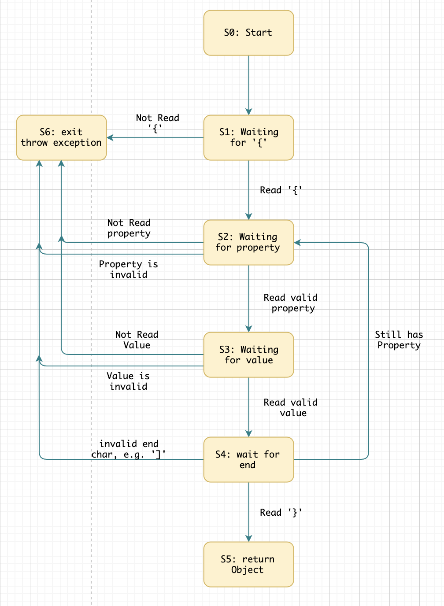

## Part 2 Functional Testing and Finite State Machines

### 2.1 Motivation for Finite Models

There are 2 major reasons we want to use finite models.

First, finite models capture the specification.
They enables us to find out the ambiguity of the specification.
Finite models also force us to think about the specification from a different
perspective.

Second, finite models inform us what test cases can and should be written. It
also gives us a criterion for how many test cases are enough. For example, if
we can draw a finite state machine for a software system we are testing, then
we can make test cases to cover each state of this finite state machine, and
also make test cases to cover each state transition in it. When we are able
to cover all the states and all the transition, it gives us some level of
confidence that our test cases are good.

### 2.2 Functional Models in `jackson`

Since `jackson` is a very big system, we will only choose a small component
to describe its functional model.

The component we choose is the same as in the Part 1, i.e. the
`readValue(String content, Class<T> valueType)`
function in the a `ObjectMapper` class.

The following figure shows the finite state machine for the `readValue` function.



We will still use `Avenger` class as our example:

```java
static class Avenger {
    public String name;
    public int age;
}
```

#### 2.2.1 `S1: waiting for {`

Because this `readValue(String content, Class<T> valueType)`
function expects a valid JSON string for the `content` argument,
it is looking for the left bracket `{` char at the beginning. If it doesn't find
`{`, it will throw a `MismatchedInputException`. For example, if
`content = "\"name\":\"Captain America\"}"`. A test case called `testMissingLeftBracket`
is to cover this case, and it covers the state transition `S0 -> S1 -> S6`.

#### 2.2.2 `S2: waiting for property`

Once it finds the `{` char, it goes to state `S2` and waits for a `property` name.
In this state, if it doesn't find a `property` name or it finds a `property` name
that doesn't exist in the `Class<T> valueType`, it will exit and throw an exception.
For example:
* when `content = "{:\"Captain America\"}"` where the property is missing.
  (test case: `testMissingProperty`).
* when `content = "{\"weapon\":\"Shield\"}"` where the property doesn't exist in `class Avenger`.
  (test case: `testInValidProperty`).

These test cases cover the state transition `S0 -> S1 -> S2 -> S6`.

#### 2.2.3 `S3: waiting for value`

Once a valid `property` name has been found, it goes to state `S3` and waits for
a value. In this state, if it doesn't find a `value` or it finds a value of the
wrong type, it will exit and throw an exception. For example:

* when `content = "{\"name\":}"`, where a value is missing.
  (test case: `testMissingValue`).
* when `content = "{\"name\": [1,2,3] }"`, where the `name` property expects
  a `String` type value, but gets an `Array` type instead.
  (test case: `testInValidValue`).

These test cases cover the state transition `S0 -> S1 -> S2 -> S3 -> S6`.

#### 2.2.4 `S4: waiting for end`

Once a valid `value` has been found, it goes to state `S4` and waits for a `}`.
In this state, there could be 3 cases:
1. If it finds an invalid character at the end, like a `]`, it will exit and
  throw an exception.
    * E.g. `content = "{\"name\": \"Captain America\" ]"`.
    * Test case `testInValidEnd` covers state transition:
      `S0 -> S1 -> S2 -> S3 -> S4 -> S6`.
2. If it finds it did not reach the end of the `content`, it will go back to `S2`
  and wait for another property.
    * E.g. `content = "{\"name\": \"Captain America\",\"age\": 102}"`.
    * Test case `testTwoProperties` covers state transition:
      `S0 -> S1 -> S2 -> S3 -> S4 -> S2`.
3. If it finds `}`, it will go to state `S5` and
   return the constructed `Avenger` object.
    * E.g. `content = "{\"name\": \"Captain America\"}"`.
    * Test case `testValidEnd` covers state transition:
      `S0 -> S1 -> S2 -> S3 -> S4 -> S5`.

### 2.3 Conclusions for Part2

We have build the finite state machine for
`readValue(String content, Class<T> valueType)` function. The FSM has 7 states.
We have made test cases to cover all the states and all the transitions
between these states.

All the tests have been added to directory:
`src/test/java/com/fasterxml/jackson/databind/SWE261Part2Test.java`.
