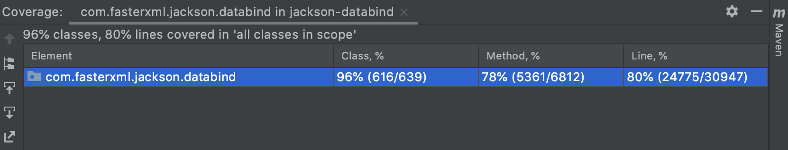
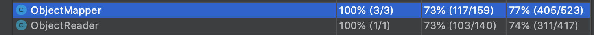

## Part 3 White Box Testing and Coverage

### 3.1 Motivation For Structural Testing

Although structural testing is not a way to capture specification like functional
model, it still has several benefits.

First, it tells us what test cases can and should be written. When we have the
the structural model, we need to make test cases that cover every node and every
transition. So we know when our tests are enough.

Second, it allows for analyses and automated assistance.

### 3.2 Coverage on `jackson`

#### 3.2.1 How to run coverage tool in `IntelliJ`

Running coverage tool in `IntelliJ` is straightforward. Here are the steps:

1. In the Project structure, Right click the fold containing all the test cases,
  In our case, it's `src/test/java/com/fasterxml/jackson/databind`.
2. Select `More Run/Debug`
3. Select `Run ... With Coverage`
4. One useful feature is one can disable some test cases in the coverage by
  editing the configuration, just choose
  `Edit Run Configuration -> Code Coverage -> Modify -> Exclude Classes and Packages`.

#### 3.2.2 The Original Coverage

The original coverage is shown in this figure.



We will again first focus on the `readValue` function in `ObjectMapper` class
as we did in the previous 2 parts of this project.
The coverage for `ObjectMapper` class is shown in this table:

| Class          | Method         | Line           |
| :------------- | :------------- | :------------- |
| 100% (3/3)     | 64% (103/159)  | 66% (349/523)  |

### 3.3 Uncovered Code and Improving the coverage

In `ObjectMapper` class, there are a couple of overloaded `readValue` function
are not covered in existing test suit. They all do the same thing, i.e. converting
a JSON string to a Java Object.

The `readValue` can take different source
as input, for example, `String`, `InputStream`, `Reader`, `File`, `URL` and
`byte[]` etc. When specifying the JAVA class, there are also 3 ways:
`Class<T>`, `TypeReference<T>` and `JavaType`.

* The first uncovered method is as follows, which is in `ObjectMapper` class.
  We have a test case called
  `testReadValueWithReaderAndTypeReference` to cover it.

```java
public <T> T readValue(Reader src, TypeReference<T> valueTypeRef)
```

* The next uncovered method is as follows, which is in `ObjectMapper` class.
  We have a test case called
  `testReadValueWithReaderAndJavaType` to cover it.

```java
public <T> T readValue(Reader src, JavaType valueType)
```

* The next uncovered method is as follows, which is in `ObjectMapper` class.
  We have a test case called
  `testReadValueWithInputStreamAndJavaType` to cover it.

```java
public <T> T readValue(InputStream src, TypeReference<T> valueTypeRef)
```

* The next uncovered method is as follows, which is in `ObjectMapper` class.
  We have a test case called
  `testReadValueWithInputStreamAndJavaType` to cover it.

```java
public <T> T readValue(InputStream src, JavaType valueType)
```

* The next uncovered method is as follows, which is in `ObjectMapper` class.
  We have a test case called
  `testReadValueWithByteArrayAndLengthAndClass` to cover it.

```java
public <T> T readValue(byte[] content, int offset, int len, Class<T> valueType)
```

* The next test case `testReadValueWithByteArrayAndLengthAndClass` is to
  cover the following untested functions.

```java
public <T> T readValue(byte[] content, int offset, int len, TypeReference<T> valueTypeRef)
public <T> T readValue(byte[] content, JavaType valueType)
public <T> T readValue(DataInput src, JavaType valueType)
public <T> T readValue(File src, Class<T> valueType)
```

* The next test case `testReadValueWithFile` is to test those functions when
  the input `json` string stored in a file.

```java
public <T> T readValue(File src, Class<T> valueType)
public <T> T readValue(File src, TypeReference<T> valueTypeRef)
public <T> T readValue(File src, JavaType valueType)
```

* The next test case `testReadValueWithURL` is to test those functions when
  the input `json` string stored in a file.

```java
public <T> T readValue(URL src, Class<T> valueType)
public <T> T readValue(URL src, TypeReference<T> valueTypeRef)
public <T> T readValue(URL src, JavaType valueType)
```

### 3.4 Conclusions for Part3

In this part of the project, we have chose some untested `readValue` function
from `ObjectMapper` class.
With the added test cases, we are able to increase the line coverage for
`ObjectMapper` from 349 to 405, as shown in the figure below:



All the tests have been added to directory:
`src/test/java/com/fasterxml/jackson/databind/SWE261Part3Test.java`.
