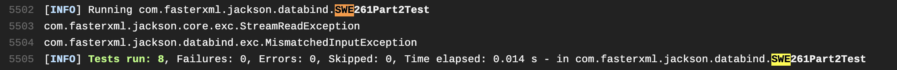

## Part 4. Continuous Integration.

### 4.1 Introduction

When there are multiple developers working on the same project and they are working on different components, their individual components are constantly evolving. If they don't get each others' latest code for a long time, it is very likely when they finally get others' latest code, a lot of problems will pop up and a log of tests will fail.

To avoid this situation, it is better to use continuous integration. Continuous integration requires developers to commit and push their changes everyday, so everybody gets others' changes everyday. And at the end of the day, the current and latest version should always build successfully and pass all tests.

The reasons for using continuous integration is we can detect bugs much earlier. When developers commit their code at the end of day, we can immediately identify if there are some failing tests in today's code. Because one day's code won't be too many, it is much easier to diagnose where the bug is and also to fix it.

### 4.2 Using `TravisCI`

The first step is to sign on with my Github account. And then we need to click the `+` sign on the left part to add our project `jackson-databind` to `Travis`.  


Then after we have added our project `jackson-databind` for the first time, it will not automatically trigger build, so we can trigger it manually by clicking `more options` -> `trigger build` as shown in the figure below.


Since this project has already had one `.travis.yml`, we do not need to create another one. But I did a little modification to it by commenting out `ppc64le` architecture and `openjdk8` JDK as shown in the figure below. So it will save some machine resources.

<div style="page-break-after: always;"></div>


As we can see in the second figure, the first build did not pass. It looks like it is `jackson-databind`'s own problem.

```
[ERROR] /home/travis/build/foodcourt2021/jackson-databind/src/main/java/com/fasterxml/jackson/databind/ser/DefaultSerializerProvider.java:[29,8] com.fasterxml.jackson.databind.ser.DefaultSerializerProvider is not abstract and does not override abstract method hasPrettyPrinter() in com.fasterxml.jackson.core.ObjectWriteContext
```

So what we did is to pull the latest changes from the original git repository (`https://github.com/FasterXML/jackson-databind`) and merge with my local one and pushed it back to my forked project (`https://github.com/foodcourt2021/jackson-databind`). This time it automatically triggers the build and the build passed without errors, as shown in the figure below.


We can also see that all my previous tests for part 1, 2, 3 passed without errors as expected.




<div style="page-break-after: always;"></div>

### 4.3 Conclusions

In this part, we have tried the `TravisCI` for continuous integration. We were able to use `TravisCI` to automatically build our code base and all tests passed successfully.
