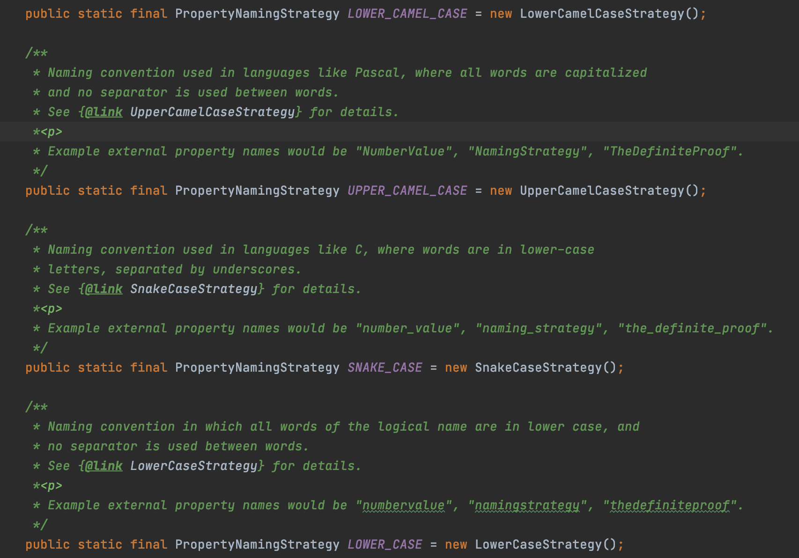
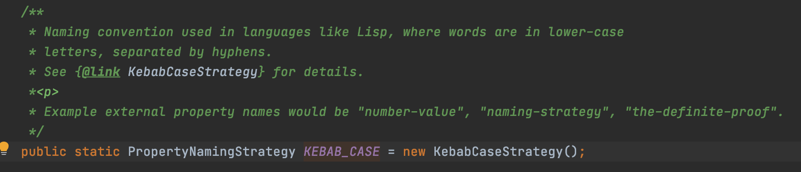
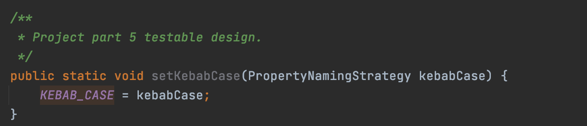
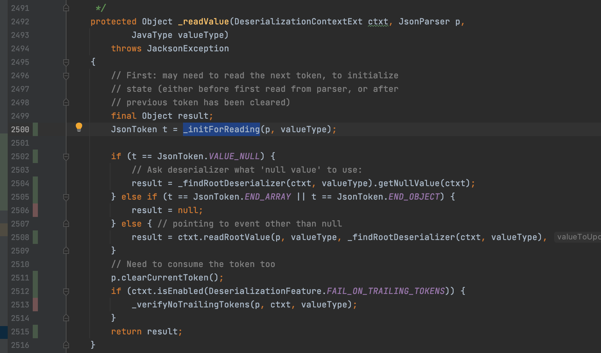
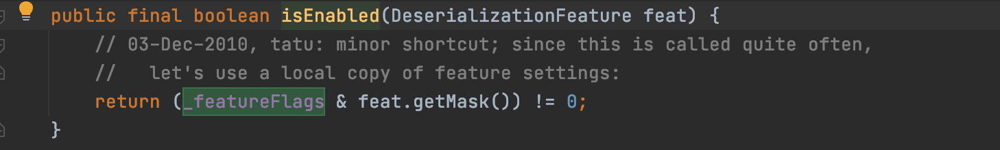
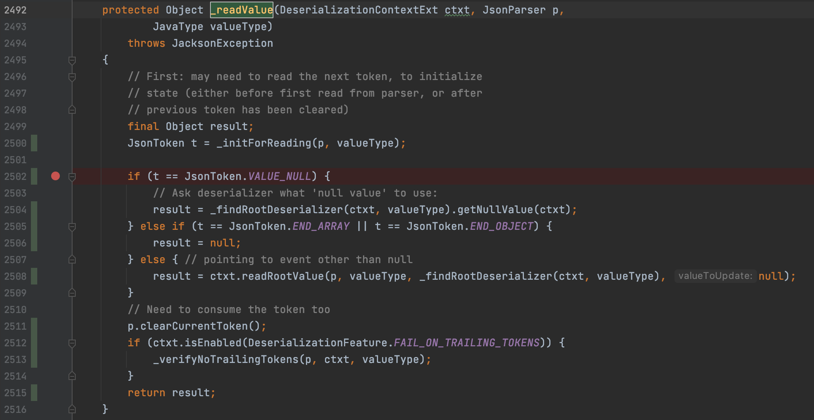

## Part 5. Testable Design. Mocking.

### 5.1 Testable Design

#### 5.1.1 Introduction

In the lecture, we learned there are a couple of principles that we should follow to make our design more testable, and they are:
1. Avoid complex private methods.
2. Avoid static methods.
3. Be careful hardcoding in “new”.
4. Avoid logic in constructors.
5. Avoid Singleton Pattern.

#### 5.1.2 `PropertyNamingStrategies` class in `jackson-databind`

In `jackson-databind`, we found a class called `PropertyNamingStrategies`. This class defines some certain naming convention strategies that are used during the translation between a java object and a `JSON` string. For example, let's say we have an `Avenger` class like this:

```java
static class Avenger {
    public String heroName;
}
```

And we have an `Avenger` object `avenger` with `avenger.heroName = "Captain America"`. When `jackson-bind` converts this `avenger` to a `JSON` string, the default output will be like `{"heroName": "Captain America"}`, i.e. the key of the `JSON` object is in lower camel case. We can modify this behavior by output
upper camel case or kebab case or something else, e.g.

* `upper camel case`: `{"HeroName": "Captain America"}`
* `kebab case      `: `{"hero-name": "Captain America"}`

This feature is particularly useful when transforming a `JSON` string to a java object, when the key of the `JSON` string use some naming conventions other than the default lower camel case used in java.

<div style="page-break-after: always;"></div>

### 5.1.3 Problematic Implementations in `PropertyNamingStrategies`

In this `PropertyNamingStrategies` class, there are a few hardcoded `new` statements as shown in the figure below:



This is a violation of the third item in section 5.1.1 . Because the hardcoded `new` is used, it is impossible to use a `stub` implementation. If we ever need to change the implementation, we have to go into this class and edit the source code manually. We can improve the design by making these members not `final` and adding some `getters/setters` methods to the class, like shown in the following figure. This way we can replace or "stub-out" the implementation.




<div style="page-break-after: always;"></div>

For example, we can have a new strategy called `KebabCaseStrategyWithSWE261` like following. What it does is when converting a java object to a `JSON` string, it always add a suffix `-swe261` to the `key`. For example, the converted `JSON` string of `avenger` would be `{"hero-name-swe261": "Steve Rogers"}`.

```java
public static class KebabCaseStrategyWithSWE261 extends KebabCaseStrategy {
    @Override
    public String translate(String input) {
        String ret = super.translate(input) + "-swe261";
        return ret;
    }
}
```

#### 5.1.4 New test case

We created a test case like following. Note that we use the newly created setter `setKebabCase` (line 4) to swap out the default implementation with our new implementation `KebabCaseStrategyWithSWE261`. Then the converted `JSON` string will have a `suffix` of `-swe261`. And conversely, when we receive a `JSON` string with a suffix `-swe261`, we are able to create an `avenger` object.

```java
public void testKebabCaseWithSWE261() {
    Avenger avenger = new Avenger();
    avenger.heroName = "Captain America";
    PropertyNamingStrategies.setKebabCase(new PropertyNamingStrategies.KebabCaseStrategyWithSWE261());
    ObjectMapper m = jsonMapperBuilder()
            .propertyNamingStrategy(PropertyNamingStrategies.KEBAB_CASE)
            .build();
    assertEquals(aposToQuotes("{'hero-name-swe261':'Captain America'}"), m.writeValueAsString(avenger));

    avenger = m.readValue(aposToQuotes("{'hero-name-swe261':'Steve Rogers'}"),
            Avenger.class);
    assertEquals("Steve Rogers", avenger.heroName);
}
```

The updated class `PropertyNamingStrategies` is in `src/main/java/com/fasterxml/jackson/databind/PropertyNamingStrategies.java` and the new test case is in `src/test/java/com/fasterxml/jackson/databind/SWE261Part5Test.java`.

<div style="page-break-after: always;"></div>

### 5.2 Mocking

#### 5.2.1 Introduction

A `mock` object is A fake object that decides whether a unit test has passed or failed by watching interactions between objects. A mock waits to be called by the class under test and makes sure that it was contacted in exactly the right way.

There are a couple Mock object frameworks for java, e.g. `android-mock, EasyMock, Mockito, jMock`.

#### 5.2.2 Use `Mockito` with `jackson-databind`

In code coverage, it's usually very difficult to get 100% coverage. This is because in the program we can have some condition checks, and sometimes that condition is very hard to be true. For example, assume we have a `if` condition to check whether we run out of memory, and if it is true, our program will do some error handling. But because the typical memory in a modern computer is so big and it's very unlikely our test cases can run out of memory, so the error handling function never gets tested.

One great feature about mocking is that it can make the out of memory condition, or any other condition checks to be true, and our error handling function can be tested. We will use this feature of mocking to improve our code coverage. We will use `Mockito` to do the mocking.

First, we need to include `Mockito` in our `jackson-databind` project. Since `jackson-databind` is a Maven project, we only need to add the following `dependency` in `pom.xml`:

```xml
<!-- For project part 5 "mock"   -->
<dependency>
  <groupId>org.mockito</groupId>
  <artifactId>mockito-core</artifactId>
  <version>2.23.0</version>
  <scope>test</scope>
</dependency>
```

Like in Part 3, we focus on the `ObjectMapper` class. There is a `_readValue` function in this class. What it does is, basically, it reads a `JavaType` "thing" from a `JsonParser`. For example, if we have a `String` of `"age 100"`, you can use `_readValue` to first read a `String`, which would be `"age"`, then read a `Integer`, which would be `100`. Now we can see from the following figure that there are 2 lines are not covered with current test cases, i.e. line 2506 and line 2513.



So, to cover line 2506, we just need to let the `_initForReading` function always return `JsonToken.END_ARRAY` (line 2505 `if`). The following code snippet shows how we stub the `_initForReading` function.

```java
@Test
public void testMock() {
    JsonMapper spyMapper = Mockito.spy(MAPPER);

    Mockito.doReturn(JsonToken.END_ARRAY).when(spyMapper)._initForReading(any(), any());

    JsonParser jsonParser = mock(JsonParser.class);
    when(jsonParser.nextToken()).thenReturn(null);
    when(jsonParser.currentToken()).thenReturn(JsonToken.valueOf("START_ARRAY"));

    assertEquals(null, spyMapper._readValue(spyMapper._deserializationContext(), jsonParser, SimpleType.constructUnsafe(String.class)));
    verify(spyMapper, times(1))._initForReading(jsonParser, SimpleType.constructUnsafe(String.class));
    verify(spyMapper, times(1))
      ._verifyNoTrailingTokens(jsonParser, ctxt, SimpleType.constructUnsafe(String.class));
}
```

Note that since we want to execute the real `_readValue` function to improve the code coverage, we need to create a `spy` of `ObjectMapper`, not a `mock` of `ObjectMapper`. Based on the `Mockito` documentation, it's recommended to always use `doReturn` for stubbing. We also need to stub `currentToken()` and `nextToken()` of the `JsonParser` object, otherwise there will be exceptions.

On the other hand, we are not able to cover line 2513 with mocking. Our initial thought is to stub `ctxt.isEnable` function like following:

```java
DeserializationContextExt ctxt = mock(DeserializationContextExt.class);
Mockito.doReturn(true).when(ctxt).isEnabled(DeserializationFeature.FAIL_ON_TRAILING_TOKENS);
```

However, when we do so, we are getting `org.mockito.exceptions.misusing.UnfinishedStubbingException`. And this is because `isEnalbed` is a `final` method, which is not supported.



So we have to use regular way to make `ctxt.isEnable` return `true` like following.

```java
private final JsonMapper MAPPER = JsonMapper.builder()
            .enable(DeserializationFeature.FAIL_ON_TRAILING_TOKENS)
            .build();
```

And we eventually covered all lines for this function.



#### 5.2.3 Conclusions

In this section, we use mocking and `Mockito` to improve code coverage.
The test case is called `SWE261Part5TestMock.java`.
